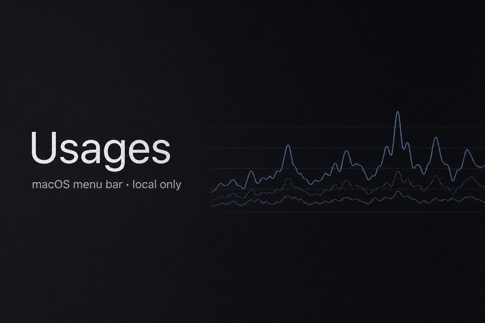
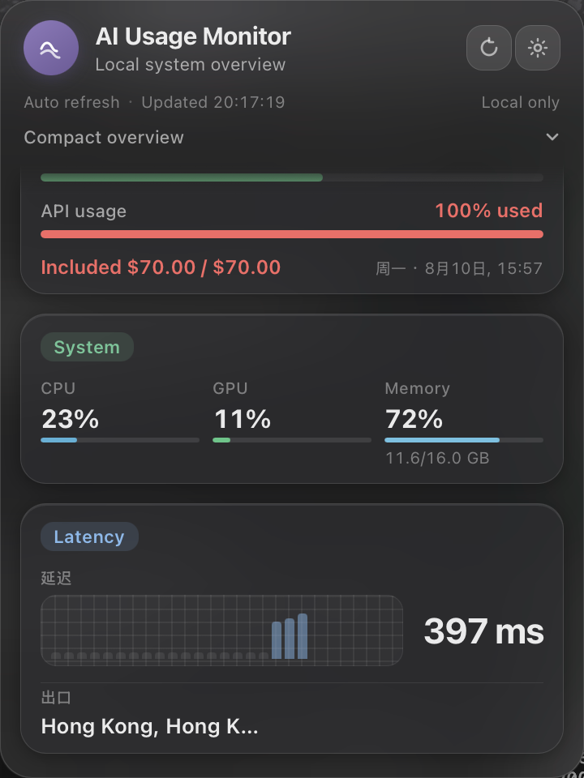

# Meterbar

菜单栏本地 AI 用量。原名 Usages。

macOS 菜单栏面板：本机查看 Cursor /（可选）DeepSeek / Codex 额度，以及系统负载与出口延迟。应用本身不需要云账号；数据与密钥留在本机。



## 功能

- **菜单栏应用** — 点击托盘图标打开紧凑面板（Tauri 2）。
- **Cursor 用量** — 从本机 Cursor 会话读取 Auto / API 计划百分比（SQLite `accessToken`）；可选粘贴 Cookie 作为兜底。
- **DeepSeek 余额**（可选）— 配置 API key 后请求 `GET /user/balance`。
- **Codex 速率限制** — 短暂拉起本机 `codex app-server`（`account/rateLimits/read`），使用机器上已有的 Codex / ChatGPT 登录态。
- **系统与网络** — CPU / GPU / 内存，可配置 URL 的延迟探测；探测成功时显示出口区域与公网 IP。
- **设置持久化** — 刷新间隔、延迟目标、高延迟阈值、提供方可见性（`auto` / `always` / `hidden`）、主面板拖拽排序。
- **仅本机** — 密钥留在磁盘 / Keychain；不会上传用量到 Meterbar 后端。

## 预览



## 环境要求

| 项目 | 说明 |
|------|------|
| macOS | 主要目标平台。托盘与私有面板 API 面向 macOS。 |
| [Rust](https://www.rust-lang.org/tools/install) | 稳定版工具链。 |
| [Node.js](https://nodejs.org/) | Vite 前端与 `@tauri-apps/cli`。 |
| Xcode CLT | Tauri / macOS 原生构建常用工具。 |

完整面板可选依赖：

- 已安装并登录 Cursor（或粘贴会话 Cookie）。
- `PATH` 上可用且已本地登录的 Codex CLI。
- 需要余额卡片时配置 DeepSeek API key。

## 开发

```bash
npm install
npm run tauri dev
```

`tauri` 脚本转发到 CLI（`npm run tauri -- <args>` 亦可）。不要使用不存在的 `tauri:dev` 脚本名。

仅前端（无 Rust 托盘）：`npm run dev`（Vite，地址见 `tauri.conf.json`）。

## 构建

```bash
npm run tauri build
```

产物在 `src-tauri/target/release/bundle/`。自行安装或拷贝；本仓库不会自动装入 `/Applications`。

## 原理简述

- **技术栈：** Tauri 2（Rust）+ 原生 TypeScript / Vite UI。
- **Cursor：** 优先读本机 Cursor `state.vscdb` 会话；否则使用 Keychain 中的 Cookie（Application Support 下另有 mode-`0600` 文件兜底）。
- **DeepSeek：** API key 存 Keychain / 同上目录；余额请求仅发往 DeepSeek API。
- **Codex：** 通过 stdio JSON-RPC 拉起 `codex app-server`，读取速率限制后退出。不持久化 ChatGPT Cookie。
- **设置：** 非密钥 JSON（`settings.json`）与凭证目录相邻。Token 不会写入 settings。

出站 HTTPS 仅限你启用的提供方与探测（Cursor / DeepSeek / 延迟与出口查询）。无 Meterbar 遥测服务。

## 隐私

- 凭证：macOS Keychain（`com.usages.app`）及可选的高权限本地文件。
- 应用不同步设置与密钥。
- 提供方 API 仅看到其用量/余额本身所需的数据（与直接使用其产品相同）。
- 出口 IP / 区域来自延迟路径上的公网 IP 查询；失败时显示为空，不编造数据。

## 配置

从面板打开 **Settings**。

| 设置项 | 作用 |
|--------|------|
| Cursor / DeepSeek 凭证 | 存储或清除 Cookie / API key（UI 保存后不回显完整密钥）。 |
| Cursor 刷新（秒） | 用量轮询间隔（最小 60；默认 300）。 |
| 系统刷新（秒） | 系统 + 延迟轮询（常见 10–30）。 |
| 延迟目标 | RTT 探测 URL（默认 `https://cursor.com`）。 |
| 高延迟（ms） | UI 高亮慢 RTT 的阈值。 |
| 提供方可见性 | 每家：`auto`、`always` 或 `hidden`。 |
| 提供方顺序 | 主面板拖拽卡片；顺序会保存。 |
| 系统区块 | 开关 System + Latency 区块。 |

测试 / 隔离可用环境变量覆盖路径：

- `USAGES_CREDENTIALS_DIR` — 凭证与默认设置目录。
- `USAGES_SETTINGS_PATH` — 显式设置文件路径。

## Cursor 认证

**优先本机会话。** 若本机已安装并登录 Cursor，Meterbar 从 Cursor 的 `state.vscdb`（`cursorAuth/accessToken`）读取登录态并拉取用量。通常**不需要**粘贴 Cookie。

**何时需要 Cookie。** 本机会话缺失、无法读取，或用量请求返回 `needs_auth` 时使用可选兜底——例如本机未装 Cursor、已登出，或本地 token 失效。在 **Settings → Cursor → Session Cookie（可选）** 粘贴后保存。保存后 UI 不回显完整 Cookie，属预期行为。

**粘贴内容。** 应用存储并发送名为 `WorkosCursorSessionToken` 的浏览器会话 Cookie（可只贴 value，或完整 `WorkosCursorSessionToken=…` 形式）。若设置页文案与本文不一致，以应用内提示为准。

**从浏览器复制**（应用内仅提示「粘贴 Session Cookie」；以下为通用 DevTools 步骤）：

1. 在本机 Chrome 或 Safari 登录 [cursor.com](https://cursor.com)。
2. 打开开发者工具 → **Application**（Chrome）或 **Storage**（Safari）→ **Cookies**。
3. 选择当前登录的 Cursor 站点 Cookie 存储（`cursor.com` 或相关主机）。
4. 找到 `WorkosCursorSessionToken`，复制其 **value**，粘贴到设置页。

将 Cookie 当作密码：保存在 macOS Keychain（`com.usages.app`），可选另存 mode-`0600` 文件于 Application Support。勿分享、勿提交、勿贴进聊天或截图。

## 限制与非目标

- **Windows / Linux** — 当前非目标；托盘与路径假设以 macOS 为主。
- **Codex** — 依赖本机可用的 Codex CLI `app-server`；不是 OpenAI REST「用量控制台」客户端。
- **Cursor / 套餐配额** — 读取 Cursor 自身 UI 所依赖的非公开 / 产品端点；字段形态可能变化。
- **不是账单控制台** — 无发票、团队管理或多用户同步。
- **不是代理或 VPN** — 出口标签描述当前路径，不会改变路径。

## License

本项目采用 [MIT](LICENSE) 开源协议。
